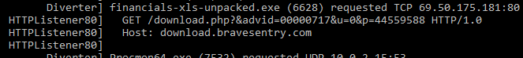
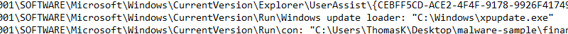
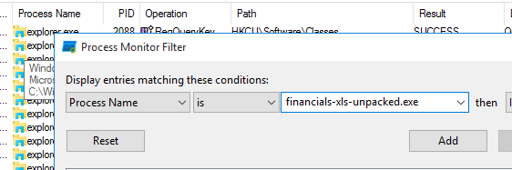
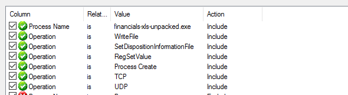

# Malware Analysis Course Notes
https://www.udemy.com/course/malware-analysis-fundamentals

## Win32 Api

NT APIs in ntdll.dll are not officially documented -> find them at http://undocumented.ntinternals.net

NtCreateSection is an undocumented API usually used by malware for *Process Hollowing*

Process Hollowing
  - Legitimate process is loaded on the system to act as a *container* for malicious code.
  - Legit code is deallocated and replaced
  - Helps process hide amongst normal processes

APIs that perform Registry Operations
  - RegCreateKey
  - RegDeleteKey
  - RegSetValue

APIs for virtual memory
  - VirtualAlloc
  - VirtualProtect
  - NtCreateSection
  - WriteProcessMemory
  - NtMapViewOfSection
  
 ## Behaviour Identification with APIs
 
 Just because these APIs are in use =/= software is malicious.
 	- Context Matters
	- What are the parameters?
	- Sets of APIs used in sequence
	
Example 1) Process Hollowing
	CreateProcessA API to make new process in suspended mode
	sets dwCreationFlag parameter to CREATE_SUSPENDED
	This is a red flag because normal programs do not do this
Example 2) WriteProcessMemory
	Writes into memory of another process
	Debuggers use this so by itself - not malicious
	If also using VirtualAllocEx & CreateRemoteThread -> likely malware
	
	This is suspicious because of the Sequence the APIs are in
	
### Using Handle to Identify Sequences

Handle is a reference to files, registry, memory, and processes
Processes use handles to do operations on the referred object
Tracking handles -> identify sequence of APIs

# Static and Dynamic Analysis

Malware analysis process
obtain malware -> static/dynamic analysis -> reporting

Static Analysis -> analysis without execution
(hashing, embedded strings, PE header)

Dynamic analysis -> analysis with execution
(monitoring changes, behavior monitoring)

Snapshot clean system -> Execute Malware -> Take Snapshot
Compare two snapshots

## Dynamic Analysis tools
Regshot - registry snapshot
Autoruns - check for persistance
Fakenet - capture network traffic to other servers
Wireshark - 
Procmon
Procdot

# Static Analysis of Malware-Sample-1

## Malware1(budget-report.exe) -> put into TridNET

TridNET shows us very likely -> file is an exe

	
## Drag Malware1 into PEstudio

This file has many indicators that it is a malicious file, the file is scored by virustotal, the file exposes TSL callbacks, the file imports symbol(s), the amount of imports is suspicious.

### Strings

PEStudio shows us in the blacklisted strings, that we can see RegDeleteValue, RegSetValueEx, these are to give the malware persistence.

Also we can notice there are plenty of networking strings like "connect, socket, gethostbyname" APIs that connect to the network.

### Imports

In the imports section, we find plenty of Registry imports for this malware to create & delete registry values.

Also in the imports we find CreateToolhelp32Snapshot, Process32First & Process32Next. Malware can use these APIs to enumerate through the process list looking for tools such as wireshark, x64dbg, procmon etc, to help prevent analysis.

## HashMyFiles

Next we are going to use HashMyFiles to generate a hash to copy the MD5 and check virustotal.

Hashes are a way to ID the file. Some files can be much to big to upload to virustotal, and for those files we can generate a hash, and just search the hash.

Search the md5 on virustotal

As we can see here, the file is clearly malicious.

# Dynamic Analysis Workflow

## Sequence

1) Start Procmon -> pause -> clear
2) Start Fakenet
3) Start Regshot, take 1st snapshot
4) Once the first snapshot is completed -> resume procmon
5) Run the malware for 1-3 mins and study the Fakenet output
6) After 3 minutes of malware runtime, pause procmon
7) Use Regshot to take the 2nd snapshot
8) Regshot -> Compare -> Compare and show output
9) Study Regshot output

Procmon filters
ProcessName = malware-name
Operation is {
	WriteFile
	SetDispositionInformationFile
	RegSetValue
	ProcessCreate
	TCP
	UDP
}
add these values one at a time to the process monitor

## Registry Persistence

There are common places that malware will install persistance in the registry.
Some of the common places are:

\Software\Microsoft\Windows\CurrentVersion\Run
\Software\Microsoft\Windows\CurrentVersion\RunOnce
\Software\Microsoft\Windows\CurrentVersion\RunServices
\Software\Microsoft\Windows\CurrentVersion\RunServicesOnce
\Software\Microsoft\Windows\CurrentVersion\Policies\Explorer\Run
\Software\Microsoft\Windows NT\CurrentVersion\Windows\AppInit_DLLs

## DLL Search Order

Directory of Program -> \windows\system32 -> \windows\system -> \windows -> Current Directory -> %PATH% 

Malware might put a dll in the Directory so that it uses that version instead of a DLL found in windows systemfiles. (Because it is earlier in the search order, once the DLL is found, the search is over.)

# Dynamic Analysis of Malware-Sample-1

- Turn on procmon -> pause -> clear
- Start fakenet
- Start Regshot -> take first shot (this will take a few minutes)
- After 1st shot is completed, turn Capture on in Procmon settings
- Start the malware

We first notice in Fakenet that the malware is trying to connect to a webserver at mbaquyahcn.biz:80

trying to post data 

- Next we take the 2nd snapshot in Regshot -> Compare 

Now Regshot opens a text file with all the changed Registy values

Here we can see the persistence, it adds a RunOnce value for the exe "\Appdata\Roaming\12648430\spollsv.exe"

And here under Files added, we can see the new exe has been added as well.

Under files deleted, we can see that during execution, the malware deleted itself.

Back under procmon, we have way too many results currently loaded. We can filter the results for the following:
	Process Name is = [exe name]
	Operation is = WriteFile
	Operation is = SetDispositionInformationFile
	Operation is = RegSetValue
	Operation is = Process Create
	Operation is = TCP
	Operation is = UDP
	

This is great, now we're only showing these specific results, and we're down to 542 events out of the 667,750 events that happened during the time procmon was active.

Now we're going to save ALL EVENTS as a logfile.mml

After that, we're going to save only the current filter results as a .CSV format file (for analysis in Procdot)

We're going to launch ProcDOT, and import the .CSV file we just generated. This will give us a graph visualization of the results.

We can see some persistence keys

These components are known as *Artifacts*.

# Network Analysis of Malware-Sample-1

Fakenet has already given us enough info to know that the malware is trying to make a HTTP POST request to a webserver at mbaquyahcn.biz:80 

With 938 bytes of information.

Next step we take the .pcap file thats in our Fakenet logs folder, for analysis in Wireshark.

Now we're going to filter for HTTP

Now we can follow the TCP stream for the POST request

Here we can see the request we saw earlier, with the encrypted data. Also we can see Fakenet's response in blue at the bottom.

Now that we're finished -> restore to previous VM snapshot.

# Lab Exercise, Analysis of Malware-Sample-2 (financials-xls.exe)

For this Lab Exercise, we recieved the file "financials-xls.exe"

When we take the program into DetectItEasy, it detects that the file is Packed with UPX. So we will use the command "upx -d -o 
financials-xls-unpacked.exe financials-xls.exe"

The malware is now unpacked, and we can use this unpacked exe for analysis.

# Static Analysis of Malware-sample-2

Now that we have the unpacked exe, we put it into TridNet.

TridNet confirms the file is an .exe file.

Next we take the file into PEStudio

The first thing we're going to check is that we see there are 7 level 1 indicators.
	1. File is scored by Virustotal
	2. File uses Russian language.
	3. The amount of imports (0) is suspicious.
	4. The first .text section is writable.
	5. The file contains self-modifying executable sections.
	6. The file contains writable and executable sections.
	7. The file references a URL pattern. (69.50.175.181)
	
Using wsock32.dll for websockets/connections.

Dialog language in Russian.

## Bintext Analysis

Here we can see the following strings:
	GetStartupInfoA
	RegDeleteKeyA
	RegSetValueExA
	RegDeleteValueA
	RegCreateKeyExA
	RegQueryValueExA
	RegCloseKey
	

We also see some HTML of a fake error message:

We also see a HTTP download request:

So we can assume this software will use scare tactics (with the fake error message) to promt the user to download a fake antivirus software (BraveSentry)

Evidenced here: 

We see a Registry key string "SOFTWARE\Microsoft\Windows\CurrentVersion\Run", followed by "C:\\Windows\xpupdate.exe". This is likely a persistence executable to be run at startup.

## Searching for encrpted string with xorsearch

In CMD, we're going to run the xorsearch command followed by the unpacked malware file as the first parameter, the second parameter will be the string we're going to be searching for, "http".

Now after this, we get 5 results.

With XOR 00, this means there was NO encryption, so we can ignore this result.
With XOR 20, these conversions were lowercase/uppercase conversions.

Therefor, we did not get any encrypted results through this search, so we can try with a different string, "This".

We search for "This" because we know that at the start of PE files, there is always the string "This program cannot be run in DOS mode", therefor if we find this string with or without encryption, we can make assumptions about the encrpytion of the rest of the file.

Now for the results:

With another XOR 00 result, we can assume that the file is NOT encrypted.

## HashAnalysis

In PEStudio, we can take the programs MD5 hash, copy it and take it into VirusTotal for the results.

And VirusTotal already has 40 flags for this unpacked exe file.

We can conclude from all of these results that this is a malicious executable.

Next, we can process with the Dynamic analysis.

# Dynamic Analysis of Malware-Sample-2

1) Open procmon, stop capturing & clear the results.

2) Open Fakenet to intercept network traffic

3) Open Regshot, and make sure we are scanning the entire C:\ Drive, take 1st shot.

4) In procmon, turn "Capture" back on, and run the malware with elevated privledges. We saw earlier that the malware is writing to the protected "C:\Windows\" folder, so we are sure that it needs administrative privledges to work.

We can see through Fakenet that the malware requested a TCP download, likely to download more malware packages:

Now we'll take our 2nd shot and compare the two Regshots

Here we see 9 new registry values added:

We can see the malware has installed persistence in the \SOFTWARE\Microsoft\Windows\CurrentVersion\Run\ folder, with "Windows update loader: "C:\Windows\xpupdate.exe"

We will add this file to our notes to check again later

another persistence key would be the following key: "SOFTWARE\Microsoft\Windows\CurrentVersion\Run\con: "C:\Users\ThomasK\Desktop\malware-sample\financials-xls-unpacked.exe" which will execute this malware program again on startup.

Under files added, we see 5 files have been created:

We take note of "C:\Users\ThomasK\AppData\Roaming\Install.dat"
as well.

## Procmon Filters & Export

As explained before, we're going to filter for results pertaining to this malware executable.

Add the rest of our filters:

Results:

We can see the two new files, xpupdate.exe and Install.dat, and we see the 3 new RegSetValue's.

Again we will export as PML & CSV formats.

We'll save both of these files to the malware the folder is in.

### Procdot Analysis

After adding the CSV file from Procmon into ProcDOT, we get this graph:

We can see:
	The TCP connection with the webserver 69.50.175.181

	Thread 8180 created file C:\Windows\xpupdate.xe
	Thread 8180 created registry key "Windows update loader" which is an Autostart Registry key

	Thread 8180 created thread 4260
		Thread 4260 created the Install.dat file.
		Thread 4260 created 2 more registry keys, one of them being the \Run\con autostart key.
		Thread 4260 also killed the original malware process

### Compare Hashes with PEStudio

If we compare the hashes of the file this malware created, with the original malware itself, we actually can see that they are the exact same file.

# Network Analysis of Malware-sample-2

