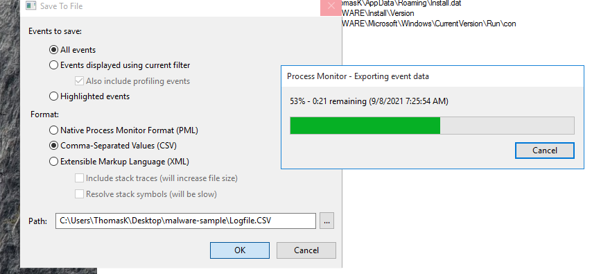

# Lab Exercise, Analysis of Malware-Sample-2 (financials-xls.exe)

For this Lab Exercise, we recieved the file "financials-xls.exe"

When we take the program into DetectItEasy, it detects that the file is Packed with UPX. So we will use the command "upx -d -o 
financials-xls-unpacked.exe financials-xls.exe"

The malware is now unpacked, and we can use this unpacked exe for analysis.

# Static Analysis of Malware-sample-2

Now that we have the unpacked exe, we put it into TridNet.

TridNet confirms the file is an .exe file.

Next we take the file into PEStudio

The first thing we're going to check is that we see there are 7 level 1 indicators.
	1. File is scored by Virustotal
	2. File uses Russian language.
	3. The amount of imports (0) is suspicious.
	4. The first .text section is writable.
	5. The file contains self-modifying executable sections.
	6. The file contains writable and executable sections.
	7. The file references a URL pattern. (69.50.175.181)
	
Using wsock32.dll for websockets/connections.

Dialog language in Russian.

## Bintext Analysis

Here we can see the following strings:
	GetStartupInfoA
	RegDeleteKeyA
	RegSetValueExA
	RegDeleteValueA
	RegCreateKeyExA
	RegQueryValueExA
	RegCloseKey
	

We also see some HTML of a fake error message:

We also see a HTTP download request:

So we can assume this software will use scare tactics (with the fake error message) to promt the user to download a fake antivirus software (BraveSentry)

Evidenced here: 

We see a Registry key string "SOFTWARE\Microsoft\Windows\CurrentVersion\Run", followed by "C:\\Windows\xpupdate.exe". This is likely a persistence executable to be run at startup.

## Searching for encrpted string with xorsearch

In CMD, we're going to run the xorsearch command followed by the unpacked malware file as the first parameter, the second parameter will be the string we're going to be searching for, "http".

Now after this, we get 5 results.

With XOR 00, this means there was NO encryption, so we can ignore this result.
With XOR 20, these conversions were lowercase/uppercase conversions.

Therefor, we did not get any encrypted results through this search, so we can try with a different string, "This".

We search for "This" because we know that at the start of PE files, there is always the string "This program cannot be run in DOS mode", therefor if we find this string with or without encryption, we can make assumptions about the encrpytion of the rest of the file.

Now for the results:

With another XOR 00 result, we can assume that the file is NOT encrypted.

## HashAnalysis

In PEStudio, we can take the programs MD5 hash, copy it and take it into VirusTotal for the results.

And VirusTotal already has 40 flags for this unpacked exe file.

We can conclude from all of these results that this is a malicious executable.

Next, we can process with the Dynamic analysis.

# Dynamic Analysis of Malware-Sample-2

1) Open procmon, stop capturing & clear the results.

2) Open Fakenet to intercept network traffic

3) Open Regshot, and make sure we are scanning the entire C:\ Drive, take 1st shot.

4) In procmon, turn "Capture" back on, and run the malware with elevated privledges. We saw earlier that the malware is writing to the protected "C:\Windows\" folder, so we are sure that it needs administrative privledges to work.

We can see through Fakenet that the malware requested a TCP download, likely to download more malware packages:

Now we'll take our 2nd shot and compare the two Regshots

Here we see 9 new registry values added:

We can see the malware has installed persistence in the \SOFTWARE\Microsoft\Windows\CurrentVersion\Run\ folder, with "Windows update loader: "C:\Windows\xpupdate.exe"

We will add this file to our notes to check again later

another persistence key would be the following key: "SOFTWARE\Microsoft\Windows\CurrentVersion\Run\con: "C:\Users\ThomasK\Desktop\malware-sample\financials-xls-unpacked.exe" which will execute this malware program again on startup.

Under files added, we see 5 files have been created:

We take note of "C:\Users\ThomasK\AppData\Roaming\Install.dat"
as well.

## Procmon Filters & Export

As explained before, we're going to filter for results pertaining to this malware executable.

Add the rest of our filters:

Results:

We can see the two new files, xpupdate.exe and Install.dat, and we see the 3 new RegSetValue's.

Again we will export as PML & CSV formats.

We'll save both of these files to the malware the folder is in.

### Procdot Analysis

After adding the CSV file from Procmon into ProcDOT, we get this graph:

We can see:
	The TCP connection with the webserver 69.50.175.181

	Thread 8180 created file C:\Windows\xpupdate.xe
	Thread 8180 created registry key "Windows update loader" which is an Autostart Registry key

	Thread 8180 created thread 4260
		Thread 4260 created the Install.dat file.
		Thread 4260 created 2 more registry keys, one of them being the \Run\con autostart key.
		Thread 4260 also killed the original malware process

### Compare Hashes with PEStudio

If we compare the hashes of the file this malware created, with the original malware itself, we actually can see that they are the exact same file.

# Network Analysis of Malware-sample-2

We use Wireshark to open the .pcap file generated by Fakenet, and filter for HTTP, because we saw that the malware attempted to connect to a webserver to download a file.

Now we can find the request, and Right Click -> Follow TCP Stream

It made the request to download a file at download.bravesentry.com

# Indicators of Compromise Report

In the file system we had the files:
	C:\Windows\xpupdate.exe
	Install.dat

In the registry we found evidence of:
	Two persistence keys

In the network analysis we found evidence of:
	TCP download request to download.bravesentry.com'

