For Malware Sample 3

We will be
-   Analyzing Lokibot Trojan
-   Using File Identification
-   Unpacking and decompiling using Exe2Aut
-   Using Ghidra Dissassembler/Decompiler
-   Using xdbg debugger
-   Using Process Hacker to dump memory

File name: sample.bin

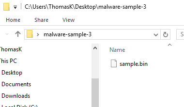

Tridnet results:

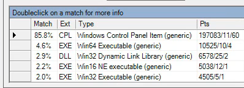

Identified as a control panel item, not much information to get here. So we will use the tool Exeinfo PE

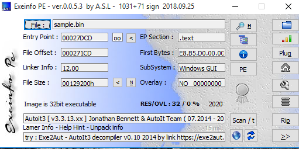

It identified the program as **Autoit3**, so we're going to use myAut2Exe for analysis.

AutoIt is a scripting language that automates windows gui & general scripting. Malware authors can use AutoIt to convert the file generated into an executable.

Analysis with PEStudio:

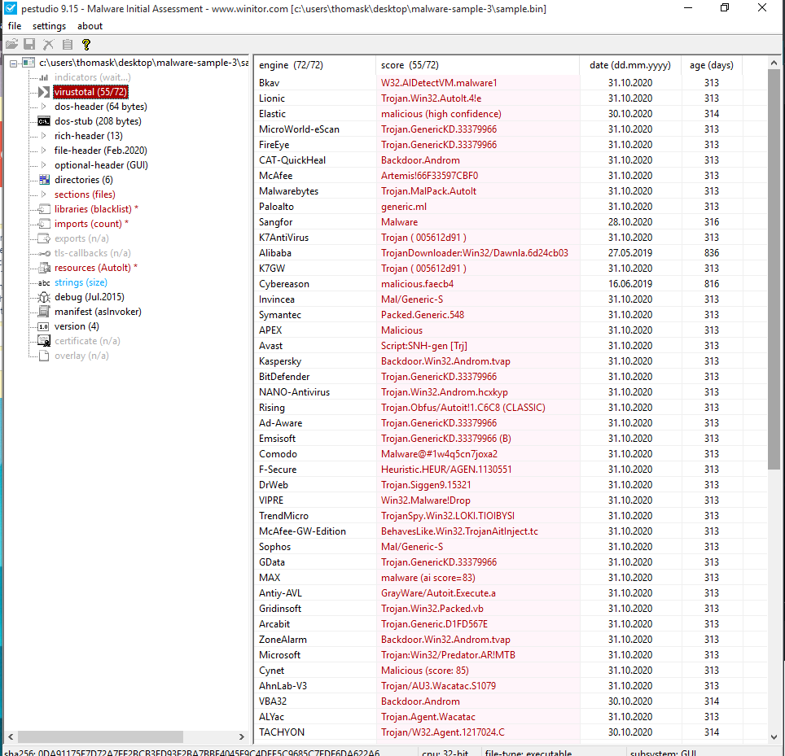

In the resources section of PEStudio, it has given the program a red flag because it detected the program as an AutoIt script. (It even shows us the file-offset of the script in rcdata 0x000C9DB8)

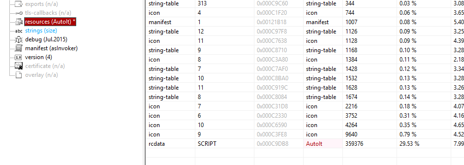

Analysis with myAut2Exe:

We scan the file with myAut2Exe, and it gives us a bunch of different outputs/files. We are interested in the unpacked .au3 file "sample_restore.au3"

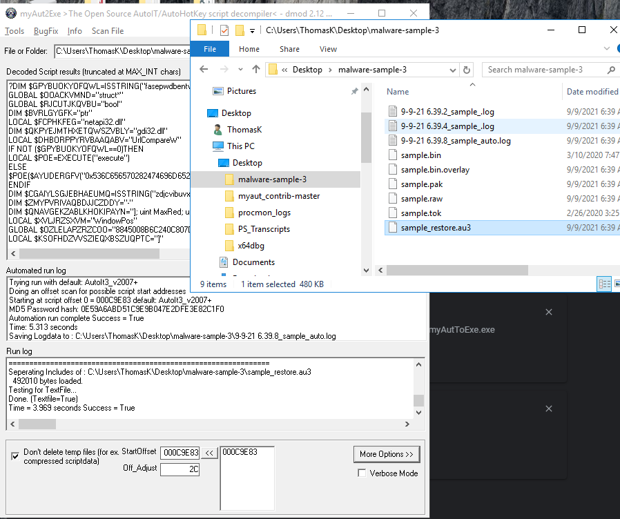

The decoded script results are clearly obfuscated:

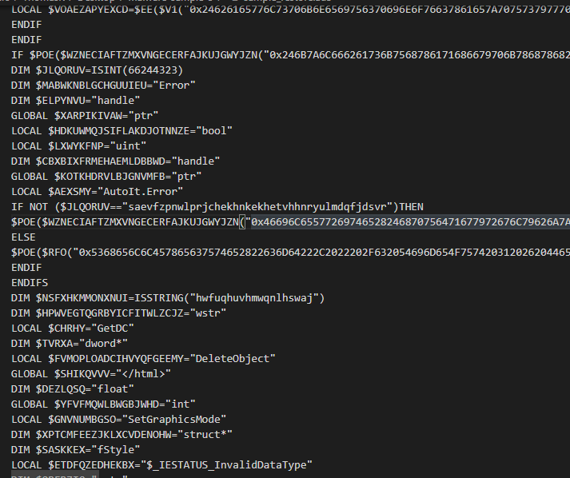

We can see this HUGE appended string which is likely shell code that isn't human readable, but the machine will execute it at runtime.

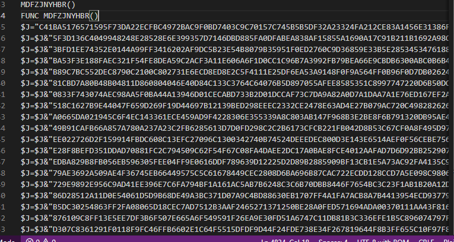

The way we will tackle this problem is by letting the program execute, and when this shellcode is loaded into memory, we will dump the memory into another file for analysis. (Using Ghidra and x64dbg)

# Using Ghidra

We're going to open ghidra, and create the project folder as the folder we unpacked the malware into.

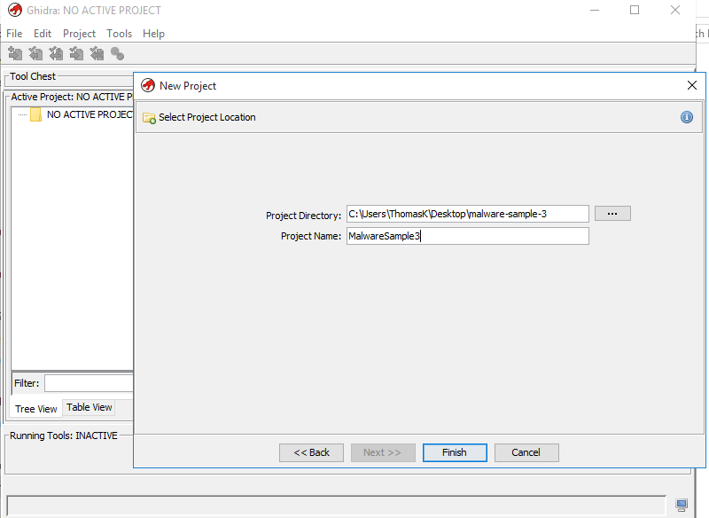

When we bring the .bin file in, ghidra detects it as a PE file.

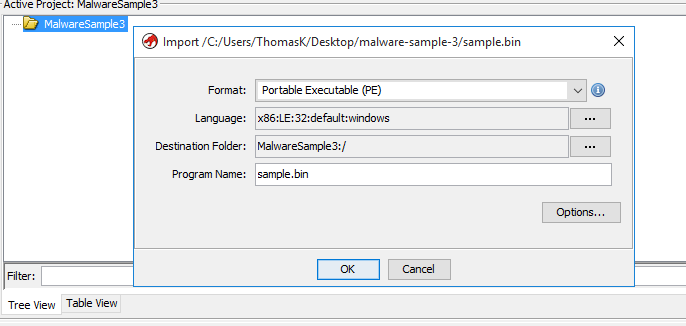

We're going to use Code Analyzer on the .bin file, and when prompted we will use the default analysis options.

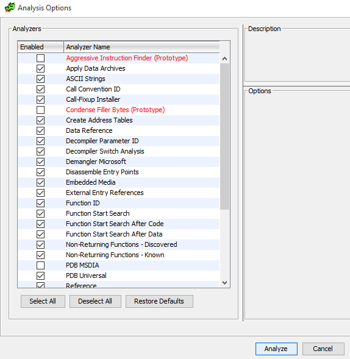

When doing analysis with dissassemblers, a good place to find the main function is to look for ___security_init_cookie with a jump to the main function.

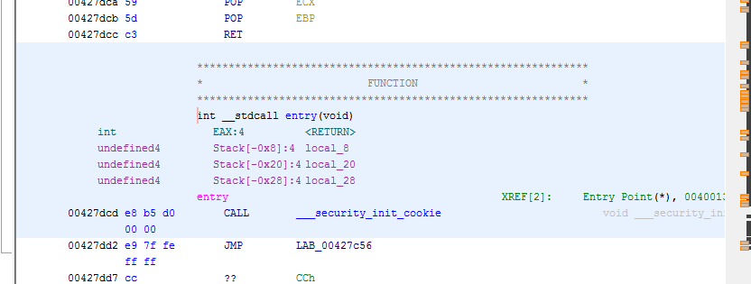

If we take the jump, we can find in the Decompiled data, we see a vunction with three parameters at the bottom. This is usually the main function that is always at every windows program. This is the [Windows Main Function Signature](https://docs.microsoft.com/en-us/windows/win32/learnwin32/winmain--the-application-entry-point).

cont.